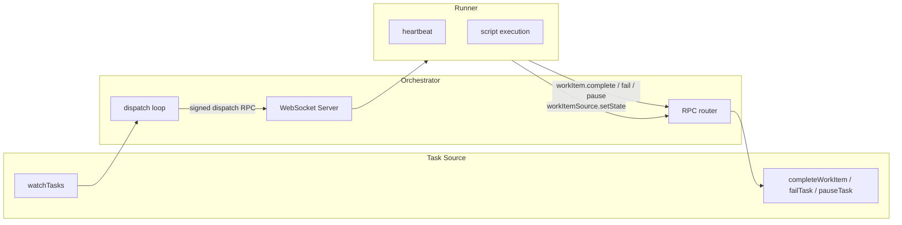

# Orchestrator v2 — Design Documentation

This folder describes **how the libraries work**: architecture, contracts, and design decisions. For usage examples and API quick-starts, see the [root README](../README.md).

## Contents

| Document                                   | Issue                                                | Summary                                                       |
| ------------------------------------------ | ---------------------------------------------------- | ------------------------------------------------------------- |
| [script-tasks.md](script-tasks.md)         | [#32](https://github.com/devzeebo/bifrost/issues/32) | Script execution primitive — the core task unit               |
| [protocol.md](protocol.md)                 | [#33](https://github.com/devzeebo/bifrost/issues/33) | Signed WebSocket RPC between orchestrator and runners         |
| [orchestrator.md](orchestrator.md)         | [#35](https://github.com/devzeebo/bifrost/issues/35) | Thin get-work + dispatch loop                                 |
| [runner.md](runner.md)                     | [#36](https://github.com/devzeebo/bifrost/issues/36) | Remote script runner                                          |
| [agent-3-task.md](agent-3-task.md)         | [#37](https://github.com/devzeebo/bifrost/issues/37) | Task Agent — a single LLM conversation, start to finish       |
| [agent-4-workflow.md](agent-4-workflow.md) | [#39](https://github.com/devzeebo/bifrost/issues/39) | Workflow Agent — coordinates Task Agents through a step graph |

## Architecture



### Design principles

1. **One execution primitive** — scripts only. LLM and workflow logic are agent packages built on top, not first-class task types.
2. **One transport** — runners always connect over signed WebSocket. No in-process direct-call shortcut.
3. **Thin orchestrator** — no dependency resolution, hooks, engines, or prompt rendering. The task source owns graph logic.
4. **Static runner trust** — authorized runner public keys are loaded from config at startup. Adding a runner requires a restart.
5. **No hooks** — v1 lifecycle hooks are removed entirely.

### Agent lifecycles

Higher-level agents are built on the [script task interface](script-tasks.md), but they behave very differently:

|                | Task Agent               | Workflow Agent                                         |
| -------------- | ------------------------ | ------------------------------------------------------ |
| **Job**        | Run one LLM conversation | Coordinate multiple Task Agents through a step graph   |
| **Dispatches** | Once                     | Twice — schedule, then verify                          |
| **Children**   | None (leaf)              | One Task Agent per step, all created on first dispatch |
| **Waits on**   | Nothing                  | All children, as blockers registered on first dispatch |

See [agent-3-task.md](agent-3-task.md) and [agent-4-workflow.md](agent-4-workflow.md) for walkthroughs with concrete examples.

### Package boundaries

```
interfaces-work          Pure types for script definitions and results
interfaces-work   Task + WorkItemSource contracts
protocol                 Wire format, signing, WebSocket peers
orchestrator             Dispatch loop, peer registry, RPC routing
runner                   Script execution, config, heartbeat, dispatch handling
engine                   Engine interface, types, and TestEngine
agent-3-task             Task Agent — single-shot engine execution as a leaf script
agent-4-workflow         Workflow Agent — DAG scheduling as a script (planned)
```

The runner package consumes `protocol` and `interfaces-work` to execute scripts remotely.

### Current status

| Component                                 | Status                                                         |
| ----------------------------------------- | -------------------------------------------------------------- |
| Script task types (`interfaces-work`)     | Done                                                           |
| Protocol + signing (`protocol`)           | Done                                                           |
| Task source interface (`interfaces-work`) | Done                                                           |
| Thin orchestrator (`orchestrator`)        | Done                                                           |
| Runner package                            | Done                                                           |
| Bifrost task source adapter               | Planned ([#40](https://github.com/devzeebo/bifrost/issues/40)) |
| Task Agent (`agent-3-task`)               | Done ([#37](https://github.com/devzeebo/bifrost/issues/37))    |
| Workflow Agent (`agent-4-workflow`)       | Planned ([#39](https://github.com/devzeebo/bifrost/issues/39)) |
