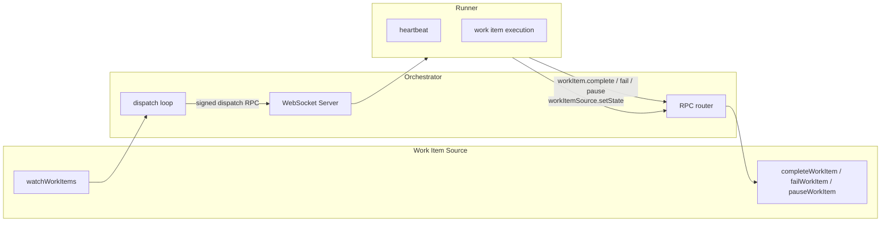

# Orchestrator v2 — Design Documentation

This folder describes **how the libraries work**: architecture, contracts, and design decisions. For usage examples and API quick-starts, see the [root README](../README.md).

## Usage guides

Plain-language how-to guides for the agent packages:

| Document                                         | Summary                                              |
| ------------------------------------------------ | ---------------------------------------------------- |
| [using-task-agents.md](using-task-agents.md)     | Set up an AGENT.md, register it, and dispatch work   |
| [using-workflow-agents.md](using-workflow-agents.md) | Define multi-step flows and register them on a runner |

For lifecycle and architecture detail, see the agent design docs below.

## Contents

| Document                                   | Issue                                                | Summary                                                       |
| ------------------------------------------ | ---------------------------------------------------- | ------------------------------------------------------------- |
| [work-items.md](work-items.md)             | [#32](https://github.com/devzeebo/bifrost/issues/32) | Work item execution primitive — the core orchestrator unit    |
| [protocol.md](protocol.md)                 | [#33](https://github.com/devzeebo/bifrost/issues/33) | Signed WebSocket RPC between orchestrator and runners         |
| [orchestrator.md](orchestrator.md)         | [#35](https://github.com/devzeebo/bifrost/issues/35) | Thin get-work + dispatch loop                                 |
| [runner.md](runner.md)                     | [#36](https://github.com/devzeebo/bifrost/issues/36) | Remote script runner                                          |
| [agent-3-task.md](agent-3-task.md)         | [#37](https://github.com/devzeebo/bifrost/issues/37) | Task Agent — a single LLM conversation, start to finish       |
| [agent-4-workflow.md](agent-4-workflow.md) | [#39](https://github.com/devzeebo/bifrost/issues/39) | Workflow Agent — coordinates Task Agents through a step graph |

## Architecture



### Design principles

1. **One execution primitive** — work items only. LLM and workflow logic are agent packages built on top, not first-class work item types.
2. **One transport** — runners always connect over signed WebSocket. No in-process direct-call shortcut.
3. **Thin orchestrator** — no dependency resolution, hooks, engines, or prompt rendering. The work item source owns graph logic.
4. **Static runner trust** — authorized runner public keys are loaded from config at startup. Adding a runner requires a restart.
5. **No hooks** — v1 lifecycle hooks are removed entirely.

### Agent lifecycles

Higher-level agents are built on the [work item interface](work-items.md), but they behave very differently:

|                | Task Agent               | Workflow Agent                                         |
| -------------- | ------------------------ | ------------------------------------------------------ |
| **Job**        | Run one LLM conversation | Coordinate multiple Task Agents through a step graph   |
| **Dispatches** | Once                     | Twice — schedule, then verify                          |
| **Children**   | None (leaf)              | One child work item per step, all created on first dispatch |
| **Waits on**   | Nothing                  | All children, as blockers registered on first dispatch |

See [agent-3-task.md](agent-3-task.md) and [agent-4-workflow.md](agent-4-workflow.md) for walkthroughs with concrete examples.

### Package boundaries

```
interfaces-work          Work item types, WorkItemSource, and handler contracts
protocol                 Wire format, signing, WebSocket peers
orchestrator             Dispatch loop, peer registry, RPC routing
runner                   Work item execution, config, heartbeat, dispatch handling
engine                   Engine interface, types, and TestEngine
agent-3-task             Task Agent — single-shot engine execution as a leaf handler
agent-4-workflow         Workflow Agent — DAG scheduling as a handler
```

The runner package consumes `protocol` and `interfaces-work` to execute work items remotely.

### Current status

| Component                                      | Status                                                         |
| ---------------------------------------------- | -------------------------------------------------------------- |
| Work item types (`interfaces-work`)            | Done                                                           |
| Protocol + signing (`protocol`)                | Done                                                           |
| Work item source interface (`interfaces-work`) | Done                                                           |
| Thin orchestrator (`orchestrator`)             | Done                                                           |
| Runner package                                 | Done                                                           |
| Bifrost work item source adapter               | Planned ([#40](https://github.com/devzeebo/bifrost/issues/40)) |
| Task Agent (`agent-3-task`)                    | Done ([#37](https://github.com/devzeebo/bifrost/issues/37))    |
| Workflow Agent (`agent-4-workflow`)            | Done ([#39](https://github.com/devzeebo/bifrost/issues/39))    |
