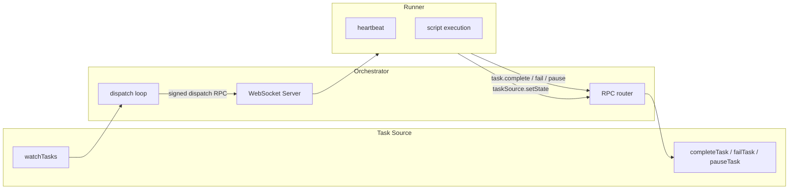

# Orchestrator v2 — Design Documentation

This folder describes **how the libraries work**: architecture, contracts, and design decisions. For usage examples and API quick-starts, see the [root README](../README.md).

## Contents

| Document | Issue | Summary |
|---|---|---|
| [script-tasks.md](script-tasks.md) | [#32](https://github.com/devzeebo/bifrost/issues/32) | Script execution primitive — the core task unit |
| [protocol.md](protocol.md) | [#33](https://github.com/devzeebo/bifrost/issues/33) | Signed WebSocket RPC between orchestrator and runners |
| [orchestrator.md](orchestrator.md) | [#35](https://github.com/devzeebo/bifrost/issues/35) | Thin get-work + dispatch loop |

## Architecture



### Design principles

1. **One execution primitive** — scripts only. LLM and workflow logic are agent packages built on top, not first-class task types.
2. **One transport** — runners always connect over signed WebSocket. No in-process direct-call shortcut.
3. **Thin orchestrator** — no dependency resolution, hooks, engines, or prompt rendering. The task source owns graph logic.
4. **Static runner trust** — authorized runner public keys are loaded from config at startup. Adding a runner requires a restart.
5. **No hooks** — v1 lifecycle hooks are removed entirely.

### Package boundaries

```
interfaces-task          Pure types for script definitions and results
interfaces-task-source   Task + TaskSource contracts
protocol                 Wire format, signing, WebSocket peers
orchestrator             Dispatch loop, peer registry, RPC routing
```

The runner package (not yet in this repo) will consume `protocol` and `interfaces-task` to execute scripts remotely.

### Current status

| Component | Status |
|---|---|
| Script task types (`interfaces-task`) | Done |
| Protocol + signing (`protocol`) | Done |
| Task source interface (`interfaces-task-source`) | Done |
| Thin orchestrator (`orchestrator`) | In progress |
| Runner package | Planned ([#36](https://github.com/devzeebo/bifrost/issues/36)) |
| Bifrost task source adapter | Planned ([#40](https://github.com/devzeebo/bifrost/issues/40)) |
| Task Agent (LLM as script) | Planned ([#37](https://github.com/devzeebo/bifrost/issues/37)) |
