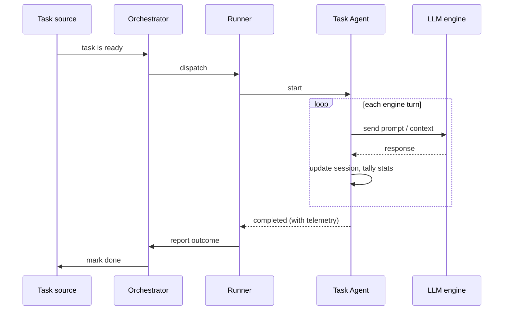

# Task Agent (`agent-3-task`)

A **Task Agent** is a single unit of LLM work. You give it a prompt (and any supporting context), it runs an engine conversation to completion, and it reports back what happened — including token usage, cost, and duration.

> Tracking issue: [#37](https://github.com/devzeebo/bifrost/issues/37)

## The problem it solves

Older orchestrator versions wrapped every execution in a rigid Start → LLM → Stop pipeline with mandatory hooks. That made simple "just run this agent" work unnecessarily heavy, and it mixed orchestration concerns into what should be a straightforward execution.

The Task Agent strips that down to the essentials: **start, run, finish**. It is the leaf node of the execution tree — the thing that actually talks to an LLM engine. Higher-level agents (like the [Workflow Agent](agent-4-workflow.md)) schedule Task Agents as children; a Task Agent never schedules other work itself.

## What it is

Think of a Task Agent as **one focused conversation with an LLM**. It is not a special task type in the orchestrator — it is a script that happens to call an engine internally. From the outside, it looks like any other task: it gets dispatched to a runner, runs, and returns an outcome.

Each Task Agent invocation is self-contained. It receives:

- **Inputs** — the prompt, engine choice, and any read-only context attached when the task was created.
- **State** — optional working memory (e.g. a session ID) that persists across turns within the same run.

It produces:

- **An outcome** — completed, failed, or paused.
- **A message** — human-readable summary of what happened.
- **Telemetry** — duration, token counts, cost, and number of engine turns.

## Lifecycle

The Task Agent lifecycle is linear. There is no pause-and-resume loop built into the agent itself — it starts, does its work, and finishes. **A Task Agent can _never_ pause**; it either completes successfully or when an error is encountered, fails.

```
  dispatched ──▶ running ──▶ completed
                    │
                    └──▶ failed
```

### 1. Dispatched

The task source marks the task as ready and the orchestrator sends it to an available runner. At this point the Task Agent has everything it needs to begin: its inputs are attached, and any saved state from a prior attempt (if this is a retry) is restored.

### 2. Running

The runner executes the Task Agent script. Inside, the agent runs a **turn loop** against the configured engine:

1. Send the current prompt/context to the engine.
2. Receive the engine's response.
3. Update the conversation session so the next turn continues where this one left off.
4. Accumulate telemetry (tokens, cost, elapsed time).
5. Decide whether to take another turn or stop.

The loop continues until the engine signals it is done, an error occurs, or a configured **maximum turn limit** is reached. This limit prevents runaway conversations from consuming unbounded resources.

During the run, the agent may checkpoint progress (session ID, partial telemetry) so that if something goes wrong mid-flight, a retry can pick up where it left off.

### 3. Finished

The agent returns one of three outcomes:

| Outcome       | What it means                                                                                |
| ------------- | -------------------------------------------------------------------------------------------- |
| **Completed** | The engine finished its work successfully. Telemetry is attached.                            |
| **Failed**    | Something went wrong — an engine error, an exceeded turn limit, or an unrecoverable problem. |

Once the runner reports the outcome, the task is **done**. The Task Agent does not wake up again on its own. If a parent workflow needs it to run again (e.g. a retry), that parent schedules a new invocation with the same session id.



## A concrete example

Suppose you want an agent to review a pull request and leave a summary comment.

1. A task source creates a Task Agent with the PR diff and review instructions as inputs.
2. The orchestrator dispatches it to a runner.
3. The Task Agent sends the diff to the engine. The engine reads it, asks a clarifying question — turn 2 answers it — turn 3 produces the final review. Three turns total.
4. The agent returns **completed** with telemetry showing 3 turns, 12k input tokens, 800 output tokens, and $0.04 cost.
5. The task source records the result. Nothing else happens unless something upstream (like a workflow) is waiting on this task.

That is the entire lifecycle. No hooks, no implicit start/stop phases, no re-entry.

## How it fits in the bigger picture

```
Workflow Agent (agent-4-workflow)
  │
  ├── Task Agent — "research the problem"
  ├── Task Agent — "write the implementation"
  └── Task Agent — "write tests"
```

A Task Agent is always a **leaf**. It does the actual LLM work. A Workflow Agent coordinates multiple Task Agents, but each Task Agent runs independently — it does not know it has siblings or a parent.

For the full coordinator lifecycle, see [agent-4-workflow.md](agent-4-workflow.md).

## Related

- [Script tasks](script-tasks.md) — the execution primitive underneath all agents
- [Workflow Agent](agent-4-workflow.md) — schedules Task Agents as children
