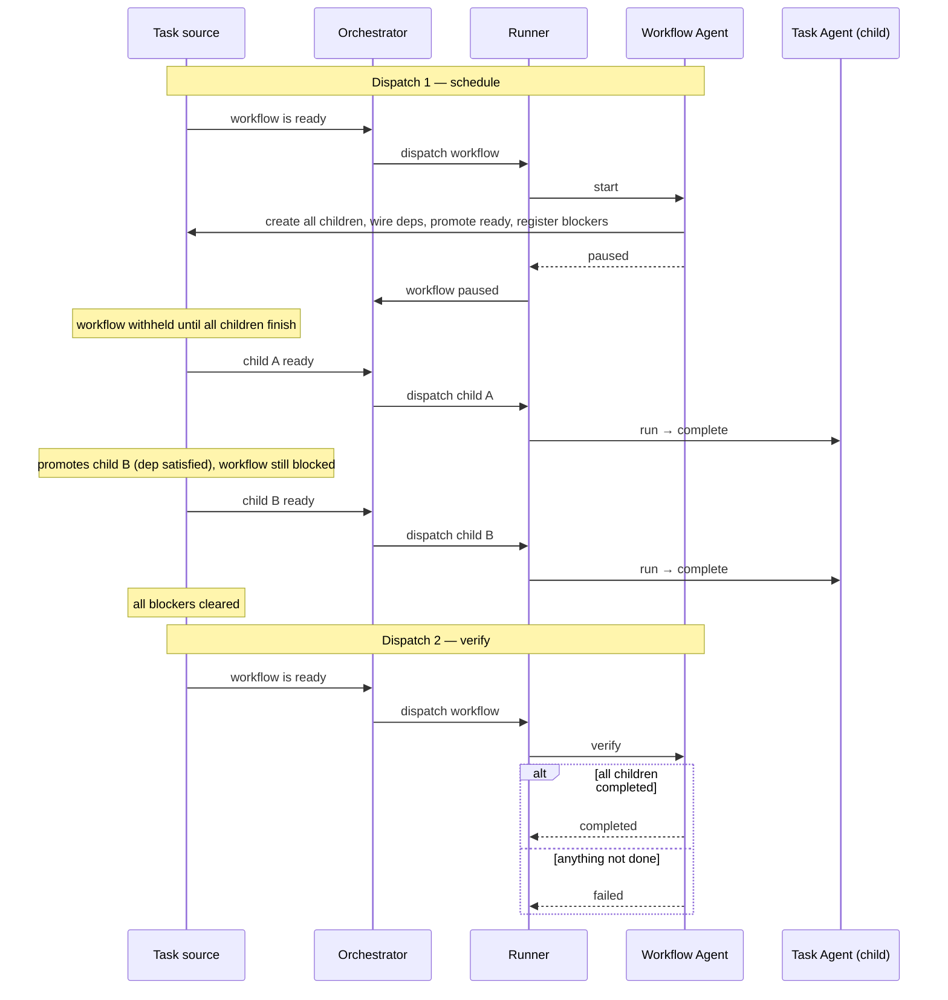

# Workflow Agent (`agent-4-workflow`)

A **Workflow Agent** coordinates multiple [Task Agents](agent-3-task.md) through a defined sequence — or graph — of steps. It does not call an LLM itself. It schedules the full step graph up front, pauses while children run, and wakes up exactly once more to verify and finish.

> Tracking issue: [#39](https://github.com/devzeebo/bifrost/issues/39)

## The problem it solves

Not every job is a single LLM conversation. Real work often decomposes into ordered or parallel steps: research first, then implement, then test. Some steps depend on others; some can run at the same time. Steps fail and need retries.

The Workflow Agent makes this explicit. You define a named workflow — a DAG of steps — and the agent handles scheduling everything on day one, then finalization when the dust settles. It is not tied to any particular task source; Bifrost is just one possible source that can host workflow tasks.

## What it is

A Workflow Agent is itself a task in the system, but its job is **coordination**, not execution. It is dispatched **twice** in the happy path:

1. **Schedule** — create all child tasks, wire dependencies, promote the initially-ready ones, register blockers, pause.
2. **Verify** — once every blocker has cleared, check that all children succeeded, aggregate stats, and complete.

Between those two dispatches the workflow does nothing. It does not wake up when individual children finish. It does not advance the graph step by step. The task source owns dependency resolution and decides which children become runnable as their prerequisites complete.

The key insight: **the workflow pauses behind its own children.** On the first run it registers every child as a blocker on itself. The task source withholds the workflow until all of those blockers clear. Only then does it get its second — and final — dispatch.

## Lifecycle

```
  dispatch 1: schedule entire graph, pause
         │
         ▼
    children run (task source gates by deps)
         │
         ▼
  dispatch 2: verify → completed
              └─ (children not all done) → failed
```

The workflow never polls or checks on children between dispatches. If it reaches the verify invocation and things are not fully done, that is an **immediate failure** — not another pause, not a wait loop.

### 1. First dispatch — schedule and pause

When the workflow runs for the first time, it reads its definition (steps and dependencies) and **schedules the entire graph in one shot**:

1. Create a child work item for every step (task or script).
2. Wire dependency edges between children (e.g. Implement is blocked by Research).
3. Promote all children to live; the work item source only dispatches those whose dependencies are satisfied.
4. Register **every child** as a blocker on the workflow itself.
5. Save state and return **paused**.

Child task steps are created with `workingDir` and a parent reference only. Enriching them with `instructions`, `engineName`, or template parameters is the job of **step decorators** (or similar workflow-specific logic), not the workflow framework.

From here the workflow goes to sleep. It will not run again until all of its child blockers have cleared.

### 2. Waiting — children do the work

While the workflow sits paused, its child Task Agents run on available runners. Each child follows the simple Task Agent lifecycle: start, run the engine loop, finish.

The task source handles everything in between:

- A child whose dependencies are not yet satisfied stays withheld.
- When a prerequisite completes, the next child becomes ready and gets dispatched.
- Steps that can run in parallel do so — the orchestrator just dispatches whatever the source says is ready.

The workflow is not involved in any of this. It does not re-enter when Research finishes so it can schedule Implement. Implement was already created on the first dispatch — it was just waiting on its dependency.

### 3. Second dispatch — verify and finish

When the last child blocker clears, the workflow becomes ready and is dispatched for the **second and final time**.

This invocation is purely about wrapping up. The workflow checks that every child reached a successful terminal state:

- **All children completed** → return **completed**.
- **Anything failed or still outstanding** → return **failed** immediately. The workflow does not pause again and does not attempt recovery.

There is no third happy-path dispatch. Two runs, done.



## Walkthrough: a linear workflow

Consider **Research → Implement → Test**.

**Dispatch 1 — schedule**

The workflow creates all three child Task Agents at once. Research has no dependencies, so it is promoted to live immediately. Implement is blocked by Research. Test is blocked by Implement. The workflow registers all three as blockers on itself and pauses.

**Waiting — children run in order**

| Event               | What the task source does                   |
| ------------------- | ------------------------------------------- |
| Research completes  | Promotes Implement to live; dispatches it   |
| Implement completes | Promotes Test to live; dispatches it        |
| Test completes      | Last blocker clears; workflow becomes ready |

The workflow does not run during any of this.

**Dispatch 2 — verify**

The workflow wakes up, confirms all three children completed successfully, and returns **completed**.

```
Time ──────────────────────────────────────────────────────────▶

Workflow:  [schedule all, pause]················································[verify, complete]
                │                                                                          │
Research:        [════════ run ════════]✓
                                              Implement:       [════════ run ════════]✓
                                                                                Test:    [════ run ════]✓
```

Two workflow dispatches. Three child dispatches. The task source bridges the gap.

## Walkthrough: parallel steps

Consider a diamond: **Plan → {Build, Document} → Review**.

**Dispatch 1** creates all four children and wires the graph. Only Plan is promoted initially. The workflow pauses behind all four.

**Waiting:**

| Event              | What happens                                                  |
| ------------------ | ------------------------------------------------------------- |
| Plan completes     | Build and Document both become ready; dispatched concurrently |
| Build completes    | Review still blocked by Document                              |
| Document completes | Review becomes ready; dispatched                              |
| Review completes   | All blockers clear                                            |

**Dispatch 2** verifies all four succeeded and completes.

```
        Plan
       ╱    ╲
   Build   Document
       ╲    ╱
       Review
```

Build and Document run in parallel because the task source dispatches both once Plan finishes. The workflow scheduled them on dispatch 1 — it did not need to wake up to promote them.

## Retries

Child step retries are handled at the child level (e.g. a retry wrapper around the Task Agent), not by re-dispatching the workflow. The workflow's first dispatch creates the graph; retries are transparent to it.

If a child exhausts all retry attempts and **permanently fails**, the workflow's blockers should eventually clear so it can run its verify dispatch and fail. How and when that dispatch is triggered is **to be resolved** — see [Open questions](#open-questions).

## How blocking works

|                                   | Task Agent | Workflow Agent                                         |
| --------------------------------- | ---------- | ------------------------------------------------------ |
| **Dispatches (happy path)**       | 1          | 2 — schedule, then verify                              |
| **Children**                      | None       | One Task Agent per step, all created on first dispatch |
| **Waits on**                      | Nothing    | All children, registered as blockers on first dispatch |
| **Wakes up when**                 | N/A        | Every child blocker has cleared                        |
| **Checks on children mid-flight** | N/A        | Never — only on the verify dispatch                    |

The orchestrator never inspects the dependency graph. It dispatches whatever the task source says is ready.

## What the workflow owns vs. what it delegates

| Workflow Agent handles                         | Task source / children handle                        |
| ---------------------------------------------- | ---------------------------------------------------- |
| Creating the full step graph on first dispatch | Which children are runnable at any moment            |
| Wiring dependency edges between children       | Promoting children as prerequisites complete         |
| Registering blockers and pausing               | Dispatching children to runners                      |
| Final verification                             | Running LLM conversations, retries, producing output |

## Child failure

When a child reaches a terminal **failed** state, the work item source treats that dependency edge as satisfied (same as **completed**). The workflow's own blockers clear, it is re-dispatched for the verify pass, and returns **failed** if any child failed or is still outstanding.

Work item sources must implement this semantics: a `blocks` edge is cleared when the blocking work item reaches any terminal state (`completed` or `failed`).

## Related

- [Using Workflow Agents](using-workflow-agents.md) — plain-language setup and usage guide
- [Task Agent](agent-3-task.md) — the leaf agent that does LLM work
- [Work items](work-items.md) — the execution primitive underneath all agents
- [Work item source](orchestrator.md) — owns dependency resolution and draft/live gating
