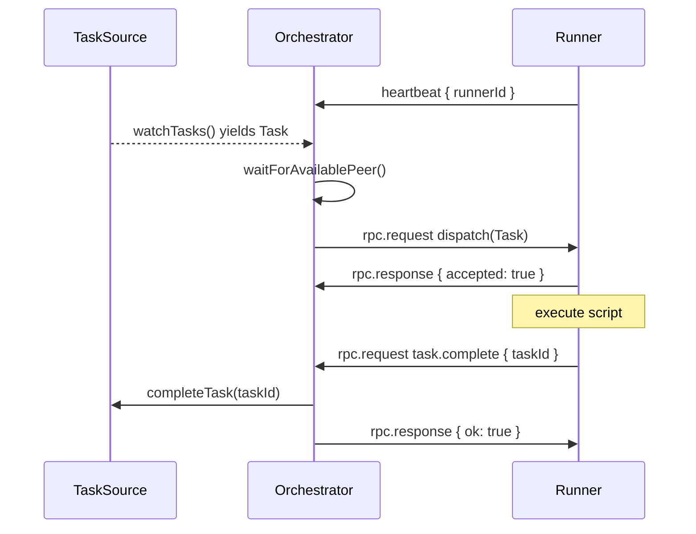

# Thin Orchestrator

> GitHub issue: [#35 — Thin orchestrator](https://github.com/devzeebo/bifrost/issues/35)

## Problem

v1's `Orchestrator.run()` pulls a task and immediately executes it in-process with hooks. v2 splits that: the orchestrator only pulls already-resolved tasks and pushes them to connected runners.

## Solution

The `@bifrost-ai/orchestrator` package implements a **get-work + dispatch** loop with no execution logic.

### What the orchestrator does

1. Starts a WebSocket server (via `protocol`).
2. Accepts runner connections authenticated by pre-shared ed25519 keys.
3. Streams tasks from `taskSource.watchTasks()`.
4. Dispatches each task to an available, heartbeating runner.
5. Routes runner RPC callbacks to the task source and scheduler.
6. Drains in-flight work when the task stream ends.

### What the orchestrator does not do

- Dependency inspection or resolution (the task source owns this)
- Hook execution or BeforeDispatch guards
- Engine selection or prompt rendering
- Script execution
- Dynamic runner registration

### Core loop



### Components

| Module | Responsibility |
|---|---|
| `runOrchestrator` | Main loop: watch tasks, dispatch, drain, cleanup |
| `PeerRegistry` | Track connected peers, heartbeats, in-flight counts |
| `DispatchTracker` | Map dispatch IDs and task IDs to in-flight entries |
| `dispatcher` | Send `dispatch` RPC to a peer |
| `DispatchAckHandler` | Handle dispatch accept/reject responses |
| `ResultHandler` | Handle `task.complete` / `task.fail` / `task.pause` |
| `RpcRouter` | Route runner RPC to task source and scheduler |
| `config` | Load authorized runner public keys from PEM entries |

### Runner availability

A peer is available for dispatch when:

1. It has sent at least one `heartbeat` with a `runnerId`.
2. Its last heartbeat is within `heartbeatTimeoutMs` (default 30s).
3. Its in-flight count is below `maxInFlightPerPeer` (default 1).

The dispatch loop blocks on `waitForAvailablePeer()` until a runner meets all three conditions.

### Dispatch lifecycle

1. Orchestrator generates a `dispatchId` and sends `rpc.request { method: "dispatch", params: Task }`.
2. Runner responds with `rpc.response { result: { accepted: true } }` or `{ accepted: false, reason }`.
3. If rejected, orchestrator calls `taskSource.failTask` and frees the peer slot.
4. If accepted, the task is in-flight until the runner sends a terminal RPC (`task.complete`, `task.fail`, or `task.pause`).
5. On peer disconnect, all in-flight tasks for that peer are failed with `"Runner disconnected"`.

### Configuration

```typescript
type OrchestratorOptions = {
  identity: PeerIdentity;
  authorizedRunners: ReadonlyMap<string, KeyObject>;
  taskSource: TaskSource;
  scheduler: Scheduler;
  host?: string;
  port?: number;
  heartbeatTimeoutMs?: number;   // default 30000
  maxInFlightPerPeer?: number;   // default 1
};
```

Authorized runners are loaded via `loadAuthorizedRunners([{ keyId, publicKeyPem }])`. Adding a runner requires updating this list and restarting.

### Scheduler proxy

Runners can call `scheduler.call(method, args)` through the orchestrator. This is a generic RPC proxy for workflow scheduling (retries, DAG advancement, etc.) without the orchestrator implementing scheduling logic itself. The `Scheduler` interface is:

```typescript
type Scheduler = {
  call(method: string, params: unknown): Promise<unknown>;
};
```

## Alternatives rejected

| Alternative | Why rejected |
|---|---|
| Orchestrator inspects/resolves dependencies | Task source owns resolution |
| Dynamic runner registration | Static pre-shared keys + restart |
| Hooks / BeforeDispatch guards | Removed entirely from v2 |

## Dependencies

- `@bifrost-ai/protocol` — WebSocket server and signed frames ([#33](protocol.md))
- `@bifrost-ai/interfaces-task-source` — task streaming and outcome recording
- Exercised end-to-end with the runner package ([#36](https://github.com/devzeebo/bifrost/issues/36))

## Verification

Acceptance criteria from the issue:

- Tasks stream from the source, are dispatched to connected runners, and complete
- Failing script → `failTask`; paused script → `pauseTask`
- Authorized runner keys from config; unknown key rejected (frames silently dropped at protocol layer)
- No dependency-resolution, hook, engine, or prompt-rendering logic in the orchestrator

See `packages/orchestrator/src/orchestrator.spec.ts` for vitest-gwt integration tests with a stub runner.
