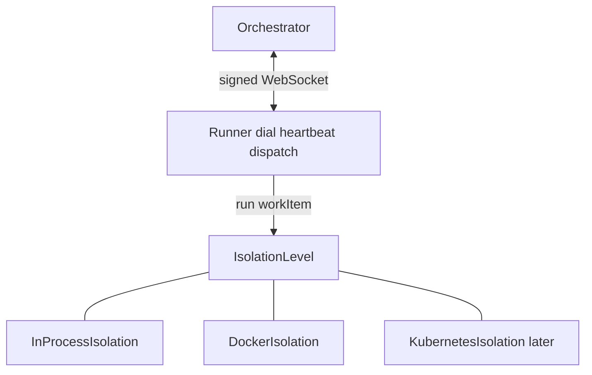
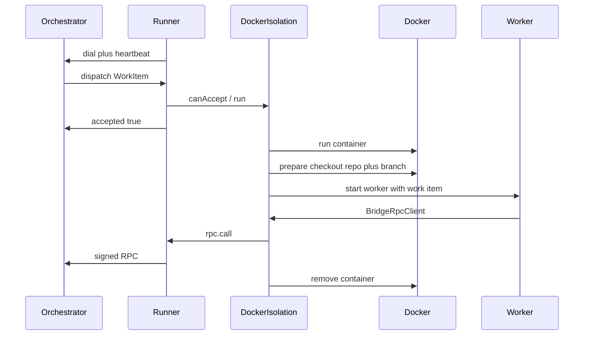

# Isolation Levels

## Problem

Today a single `Runner` process dials the orchestrator, accepts `dispatch`, and
runs the script stack in-process against a pre-existing `state.workingDir`.

Execution environment is hard-wired into the runner. There is no seam for
stronger isolation (containers, pods) or alternate workspace preparation
(git checkout per work item). Concurrent work items share a host process and
filesystem; engines with weak sandboxes inherit full host permissions.

## Proposed Solution

Separate **transport** (orchestrator peer) from **execution environment**
(isolation level).



- The **Runner** owns dial, heartbeat, dispatch accept/reject, and RPC signing.
- An **IsolationLevel** owns how a work item actually runs: where the process
  lives, how the workspace is prepared, and how script-stack execution reaches
  back to the runner's `RpcClient`.

`in-process` and `docker` are the first two implementations. A later
`kubernetes` (or firecracker, remote SSH, …) plugs in the same interface
without changing the orchestrator or the script stack.

### IsolationLevel interface

Lives in `@bifrost-ai/runner` (or a tiny shared module it exports):

```typescript
type IsolationContext = {
  /** Signed RPC into the orchestrator via the runner's peer. */
  rpc: RpcClient;
  /** Abort when the runner closes or the work item is cancelled. */
  signal: AbortSignal;
};

type IsolationLevel = {
  readonly name: string;

  /**
   * Optional pre-accept gate (capacity, image ready, etc.).
   * If it returns false / throws, dispatch is rejected.
   */
  canAccept?(workItem: WorkItem): boolean | Promise<boolean>;

  /**
   * Run one work item to a terminal outcome.
   * Must drive complete / fail / pause via ctx.rpc (directly or through a bridge).
   * Must not dial the orchestrator itself.
   */
  run(workItem: WorkItem, ctx: IsolationContext): Promise<void>;

  /** Release local resources (containers, clients). */
  close?(): void | Promise<void>;
};
```

Contract:

1. **One peer identity.** Only the Runner dials. Isolation never opens a second
   orchestrator connection for the same dispatch.
2. **Isolation owns environment.** Process boundary, filesystem, network, and
   workspace provenance are isolation concerns.
3. **Script stack is shared.** Workers (in-process or remote) still call
   `resolveStack` / `executeScriptStack` with the same registries and
   conventions.
4. **RPC is injected.** Isolation receives `RpcClient` (or a bridge that
   forwards to it). Signing keys stay on the host Runner.

### Runner wiring

```typescript
const runner = new Runner({
  isolation: new DockerIsolation({ /* … */ }),
  // default: new InProcessIsolation({ scripts, decorators, … })
});

runner.registerScript(/* still valid for in-process */);
await runner.start();
```

On `dispatch`:

1. Validate work item shape.
2. `canAccept?` → else `{ accepted: false }`.
3. `{ accepted: true }`, then `isolation.run(workItem, { rpc, signal })`.
4. Heartbeats continue on the host for the whole `run()`.

Registration of scripts/engines/agents:

| Isolation     | Where registrations live                                      |
| ------------- | ------------------------------------------------------------- |
| `in-process`  | On the Runner (today's API)                                   |
| `docker`      | Baked into the worker image bootstrap                         |
| `kubernetes`  | Baked into the worker image / pod template (same as docker)   |

The Runner may still expose `registerScript` for in-process; docker/k8s
isolations ignore host registries and use the image. Alternatively, a shared
`WorkerBootstrap` module is imported by both in-process isolation and the
image entrypoint so enrollment code is written once.

## Implementations

### InProcessIsolation

Default. Today's behavior, extracted behind the interface:

1. Resolve script stack from host registries.
2. `createScriptContext(workItem, rpc, data)`.
3. `executeScriptStack(...)`.
4. No prepare step — `state.workingDir` must already exist (current contract).

### DockerIsolation

Per-work-item container. See detailed lifecycle below.

Decisive choices for docker:

1. **Single peer + RPC proxy.** Container runs a one-shot worker; host bridges
   RPC. No second `Runner.start()` dial.
2. **One repo per docker isolation config.** `repository.url` on the isolation;
   branch from `metadata.branch`. Prepare writes `state.workingDir`.
3. **Prepare inside the container.** Dirty trees die with the container. Host
   may mount a bare-repo cache volume for speed.
4. **Baked worker image.** Agents/engines/scripts enrolled at image build time.



### KubernetesIsolation (later)

Same interface. `run` creates a Job/Pod instead of `docker run`, prepares the
workspace in the pod, and bridges RPC over the cluster network (or an exec
attach). Orchestrator and script stack stay untouched.

## Docker package layout

```
packages/runner/
  src/
    isolation.ts           # IsolationLevel + IsolationContext types
    isolations/
      in-process.ts        # InProcessIsolation
    worker.ts              # shared one-shot execute helper (no dial)
    runner.ts              # dial/heartbeat/dispatch → isolation.run

packages/runner-docker/
  src/
    docker-isolation.ts    # implements IsolationLevel
    docker-runtime.ts
    prepare.ts
    rpc-bridge.ts
    config.ts
  Dockerfile.worker
```

Reuse from `@bifrost-ai/runner` without forking execution:

- `resolveStack` / `executeScriptStack` / conventions
- `createScriptContext` + `RpcClient`
- registries / data registry / agent augment modules

`dispatch-handler` becomes thin: validate → `isolation.run`.

## Docker receiver lifecycle (per work item)

1. Validate work item. Prefer accepting when `metadata.branch` and repo config
   are present; let the worker fail unknown scripts via `failOnError`.
2. `docker run` with image, bridge mount, credential mounts, cache volume.
3. **Prepare:** clone/fetch + `git checkout <branch>` →
   `state.workingDir = "/workspace"` (fail → `workItem.fail`).
4. Start worker entrypoint: load registries, `BridgeRpcClient`,
   `executeScriptStack`.
5. On terminal / crash: forward fail if needed, `docker rm -f`.
6. Host heartbeats for the whole `run()`.

## RPC bridge (out-of-process isolations)

Host exposes a local endpoint (Unix socket preferred) into the worker
environment.

- Worker: `BridgeRpcClient` implementing `RpcClient`.
- Isolation: forward to the Runner's real `RpcClient`.
- Signing keys never leave the host.


In-process isolation skips the bridge and uses `rpc` directly.

## Config sketch

```yaml
orchestrator: { ... }
identity: { ... }

isolation:
  type: docker # or in-process

  # docker-only
  repository:
    url: git@github.com:org/repo.git
  docker:
    image: bifrost-worker:local
    maxContainers: 2
    workspacePath: /workspace
    network: bridge
  prepare:
    fetchDepth: 1
```

Branch resolution for docker/k8s: `metadata.branch` → fail if missing.

## Consumer / mapper impact

| In-process                                 | Docker / k8s                                      |
| ------------------------------------------ | ------------------------------------------------- |
| Mapper/source supplies `state.workingDir`  | Prepare writes `workingDir`                       |
| Host cwd is the repo                       | `/workspace` (or pod mount) is the repo           |
| Engines run with host permissions          | Engines limited to the isolation boundary         |

## Security / ops (docker v1)

- Orchestrator keys stay on host; only engine/git credentials mount into the
  worker.
- Always remove containers; optional max lifetime watchdog.
- Concurrency: `min(docker.maxContainers, orchestrator maxInFlightPerPeer)`.
- Out of scope for v1: multi-repo isolations, nested Docker, gVisor/rootless,
  log streaming to Bifrost notes, kubernetes.

## Implementation order

1. Define `IsolationLevel` / `IsolationContext` in `@bifrost-ai/runner`.
2. Extract `InProcessIsolation` from today's dispatch path; Runner takes an
   `isolation` option (default in-process).
3. Extract shared `runDispatchedWorkItem` / worker helper for out-of-process
   use.
4. Scaffold `@bifrost-ai/runner-docker` implementing `IsolationLevel`.
5. RPC bridge + docker runtime + git prepare.
6. Reference `Dockerfile.worker` + example bootstrap.
7. Document the interface and the two shipping implementations.

## Success criteria

- Runner can swap isolation via constructor/config with no orchestrator changes.
- `InProcessIsolation` preserves today's behavior and tests.
- `DockerIsolation` gives each work item a fresh container + checkout of
  `repository.url` @ `metadata.branch`.
- A future `KubernetesIsolation` can implement the same interface without
  touching dispatch, protocol, or script stack.
- Terminal RPC remains signed by the host Runner identity.

## Related

- [Script stack](script-stack.md) — what every isolation's worker executes
- [Runner design](../runner.md) — transport + enrollment
- [Protocol](../protocol.md) — signed WebSocket the Runner keeps
