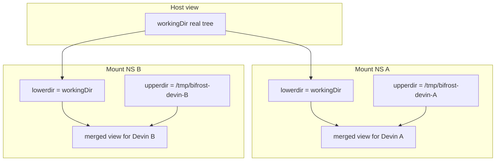

# Virtual Filesystems for Per-Instance Devin Config Isolation

## Problem

[`PLAN.md`](./PLAN.md) materializes Bifrost toolkit MCP servers into the worktree at:

```text
.devin/mcp_config.local.json
```

That works for a single Devin run, but **multiple engine instances sharing the same `workingDir` collide**:

- Instance A writes its MCP bridge env (toolkit module, work item context)
- Instance B overwrites the same file
- Both `devin -p` processes load whichever config won the race
- Toolkits / permissions / session-local state can cross-contaminate

We need each Devin child process to see its **own** `.devin/` (and optionally other Bifrost-owned paths) while still reading/writing the **real** project tree for code edits.

## Goal

Allow N concurrent `DevinEngine.execute()` calls on the same real directory, each with an independent virtual layer for:

- `.devin/mcp_config.local.json` (and other `.devin/*` Bifrost writes)
- Optionally `.bifrost/devin/agent-config.json` if kept in-tree
- Any other engine-owned overlay files that must not be shared

The real Btrfs/ext4 project directory remains the shared lower layer for source code. Only the per-instance upper layer is private.

## Approach: Linux mount namespaces + OverlayFS

Use Linux [mount namespaces](https://man7.org/linux/man-pages/man7/mount_namespaces.7.html) with [OverlayFS](https://docs.kernel.org/filesystems/overlayfs.html). With `unshare` / `CLONE_NEWNS`, create a private mount table visible only to that process and its children. Layer a writable upper directory over the real project directory; the merged view is restricted to that process tree and disappears when it exits.

No heavy container runtime required.



### Per-process layering steps

1. **Create namespaces** — spawn Devin under something like:
   ```bash
   unshare --mount --pid --fork --propagation private \
     [--user --map-root-user] \
     -- <wrapper that mounts overlay then execs devin>
   ```
2. **Set up OverlayFS** — mount a union FS where:
   - `lowerdir` = real `workingDir`
   - `upperdir` = per-run temp dir (holds `.devin/mcp_config.local.json`, etc.)
   - `workdir` = required OverlayFS work dir (same filesystem as upper)
   - mount point = either a bind-over of `workingDir` inside the namespace, or a separate merge dir that becomes cwd
3. **Isolate visibility** — mount only inside the new mount namespace so the host and other processes keep seeing the unmodified real tree
4. **Exec Devin** — `cwd` is the merged view; `-p` / `--agent-config` / MCP materialization target the overlay-backed `.devin/`

### What lives where

| Path | Layer | Shared across instances? |
|------|--------|---------------------------|
| Source tree (`src/`, etc.) | lower (real) | Yes — real edits visible to host |
| `.devin/mcp_config.local.json` | upper (virtual) | No — per instance |
| Bifrost agent-config (if in-tree) | upper | No |
| Devin session DB under project (if any) | prefer upper or external path | No (avoid session collisions) |
| Git objects / index | lower (carefully) | Yes — concurrent git mutations remain a separate problem |

**Important:** OverlayFS copy-up means the first write to a lower file copies it to upper. Code edits Devin makes will appear in upper until merged/committed; for Bifrost we typically want project file writes to hit the real tree. Prefer overlaying **only** `.devin` (and similar config dirs) via a nested overlay or bind-mount strategy, not the entire repo, unless we explicitly want a fully ephemeral worktree.

### Preferred mount strategy for Bifrost

**Narrow overlay (recommended):** do not overlay the whole repo. Inside the private mount NS:

1. Bind-mount the real `workingDir` as cwd (shared, normal)
2. Mount a small OverlayFS (or tmpfs + bind) **only over** `$workingDir/.devin`
   - lower: existing real `.devin` (if present)
   - upper: per-run `$XDG_RUNTIME_DIR/bifrost-devin/<runId>/.devin-upper`
3. Materialize `mcp_config.local.json` into that overlaid `.devin`

This gives independent MCP configs without trapping source edits in an upper layer.

**Whole-tree overlay (fallback):** overlay entire `workingDir` when we need fully isolated file mutations (harder to reconcile results back to the host).

## Alternative tools

If raw `unshare` + `mount` is too brittle (especially rootless):

| Tool | Notes |
|------|--------|
| **[Bubblewrap](https://github.com/containers/bubblewrap)** | Unprivileged sandbox used by Flatpak. Bind real dirs, overlay/tmpfs specific paths, launch one command. Strong fit for `spawn-devin.ts`. |
| **[fuse-overlayfs](https://github.com/containers/fuse-overlayfs)** | Userspace OverlayFS for clean unprivileged overlays inside a user/mount namespace. |
| **[PRoot](https://proot-me.github.io/)** | `ptrace`-based path virtualization when kernel namespaces are unavailable. Heavier/slower; last resort. |

### Bubblewrap sketch (narrow `.devin` isolation)

```bash
RUN_DIR="${XDG_RUNTIME_DIR:-/tmp}/bifrost-devin/$RUN_ID"
mkdir -p "$RUN_DIR/devin-upper" "$RUN_DIR/devin-work" "$RUN_DIR/devin-merged"

# Prepare per-run MCP config in upper before launch (or let engine write after enter)
# Then:
bwrap \
  --bind "$WORKING_DIR" "$WORKING_DIR" \
  --overlay-src "$WORKING_DIR/.devin" \
  # or: fuse-overlayfs / bind tmpfs over .devin \
  --chdir "$WORKING_DIR" \
  --die-with-parent \
  -- devin -p --respect-workspace-trust false ...
```

Exact `bwrap` flags depend on whether we use kernel overlay, fuse-overlayfs, or a simpler **tmpfs bind over `.devin`** (copy real `.devin` into tmpfs first when we need lower files).

Simplest viable v1 inside a mount NS:

```bash
# inside unshare --mount ...
mount -t tmpfs tmpfs "$WORKING_DIR/.devin"
# copy any needed real .devin files in, then write mcp_config.local.json
exec devin ...
```

That alone is enough for independent MCP configs if we do not need to persist `.devin` changes back to the host.

## Integration with `engine-devin`

Extend [`PLAN.md`](./PLAN.md) spawn path:

1. `DevinEngineConfig.isolation?: "none" | "mount-ns" | "bwrap"` (default `"bwrap"` or `"mount-ns"` on Linux, `"none"` elsewhere)
2. Before spawn, allocate `runId` + upper dirs under `$XDG_RUNTIME_DIR/bifrost-devin/<runId>/`
3. Materialize MCP config into the **upper** path (or into `.devin` after the overlay is active via a small wrapper script)
4. `spawn-devin.ts` launches via wrapper:
   - Linux: `bwrap` / `unshare` wrapper → `devin …`
   - non-Linux: fall back to `"none"` and document single-instance-per-workdir limitation
5. On process exit, discard upper dirs (MCP isolation was ephemeral by design)

Agent-config can stay in a host temp file (`os.tmpdir()`) passed by absolute `--agent-config` path — no overlay needed for that file if it is outside the worktree.

## Constraints and risks

- **Privileges:** rootless overlays need user namespaces (`unshare --user`) and/or fuse-overlayfs; some hosts disable user namespaces
- **Btrfs:** OverlayFS as upper/lower on Btrfs is generally fine; `workdir` must be empty and on same FS as `upperdir`
- **Git concurrency:** filesystem isolation does not serialize `git` index locks — still one writer per repo for git operations unless worktrees are used
- **Devin sessions:** if Devin stores session state under the project dir, overlay or redirect that path too so resumes do not cross instances
- **Cleanup:** always `--die-with-parent` / trap to unmount and remove upper/work dirs
- **Portability:** macOS/Windows need a different story (or `isolation: "none"`)

## Implementation todos

- [ ] Decide default isolation mode (`bwrap` vs raw `unshare`) and minimum Linux capabilities
- [ ] Prototype narrow `.devin` tmpfs/overlay wrapper script that execs `devin -p`
- [ ] Integrate wrapper into `spawn-devin.ts` with per-run upper dirs
- [ ] Teach `materialize-config` to write MCP config into the isolated `.devin` view
- [ ] Add concurrency test: two mocked/real spawns same `workingDir`, distinct MCP server env, no cross-read
- [ ] Document fallback when namespaces unavailable (serialize per workdir, or refuse concurrent runs)

## Success criteria

Two concurrent `DevinEngine` runs on the same real `workingDir`:

1. Each loads a different Bifrost MCP toolkit config
2. Host `.devin/mcp_config.local.json` is unchanged (or unchanged except intentional non-Bifrost content)
3. Source edits from Devin still land on the real project files (narrow overlay strategy)
4. After both exit, no leaked mounts or leftover upper dirs under the runtime path
