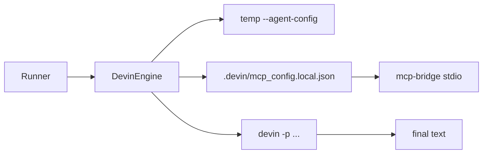

# Devin Engine (`engine-devin`)

## Approach

Implement a new package `packages/engine-devin` that implements `Engine` by spawning the local Devin CLI in print mode. This matches how Bifrost already wraps Cursor (SDK) and Claude Code (SDK), but Devin has no Node SDK — automation is CLI-first.



**Chosen integration path (committed):** `devin -p` + `--agent-config` + materialized `.devin/mcp_config.local.json`. Not ACP for v1 (richer streaming later if needed).

Verified against local Devin **3000.3.22**:

- `-p` / `--print` is the non-interactive single-turn mode
- `--agent-config` accepts: `system_instructions` (string[]), `allowed_tools` (string[]), `permissions` `{allow,deny,ask}`, `mcp_servers`, `extensions`
- Binary explicitly says: **`agent_config mcp_servers are not yet supported and will be ignored`** — so custom tools must use project MCP config files
- Project MCP shape: `{ "mcpServers": { "name": { "command", "args?", "env?" } } }` in `.devin/mcp_config.local.json` (gitignored)

## Package layout

Mirror [`packages/engine-cursor`](../engine-cursor):

| File | Role |
|------|------|
| `src/devin-engine.ts` | `DevinEngine` class: `registerToolkit`, `execute` |
| `src/tool-names.ts` | Bifrost ↔ Devin built-in name mapping |
| `src/tool-permissions.ts` | `AgentTool[]` → agent-config `allowed_tools` + `permissions` |
| `src/materialize-config.ts` | Write agent-config temp file + merge MCP servers into `.devin/mcp_config.local.json` |
| `src/bind-toolkit.ts` | Toolkit module ref → stdio MCP server config (same pattern as Cursor) |
| `src/mcp-bridge.ts` | Stdio MCP server loading Bifrost toolkits (adapt from Cursor) |
| `src/prompt.ts` | Prompt assembly (`AgentDefinition` + instructions) |
| `src/spawn-devin.ts` | `spawn`/`execFile` wrapper: cwd, args, timeout, stdout/stderr capture |
| `src/index.ts` | Public exports |
| `*.spec.ts` | Unit tests for mapping/materialize/spawn mocking |

Scaffolding: `package.json` (`@bifrost-ai/engine-devin`), `vite.config.ts` (pack entries `index` + `mcp-bridge`), `tsconfig.json`, add project reference in root [`tsconfig.json`](../../tsconfig.json).

## CLI invocation

Each `execute()` run:

```bash
devin \
  --respect-workspace-trust false \
  --permission-mode dangerous \
  --agent-config <temp-or-.bifrost/devin/agent-config.json> \
  [--model <model>] \
  [-r <sessionId>] \
  -p -- <prompt>
```

Config knobs on `DevinEngineConfig`:

- `bin` (default `"devin"`)
- `model` / agent.model → `--model`
- `permissionMode` (default `"dangerous"` — required for unattended `-p`; fine-grained rules still enforced via agent-config)
- `sandbox` → `--sandbox` (forces autonomous; only if explicitly enabled)
- `executionTimeoutMs`
- `respectWorkspaceTrust` (default `false`)

Auth: rely on existing `devin auth login` credentials (no local API key env for `-p`). Fail with a clear message if the CLI exits indicating unauthenticated.

Session resume: when `sessionId` is provided, pass `-r <sessionId>`; prompt is instructions-only (same as Cursor/Claude). Capture session id from `devin list --format json` only if needed later — v1 returns whatever resume id we already have / best-effort from stderr if exposed.

Stats: v1 returns `stats: null` or duration-only (CLI `-p` does not emit Cursor/Claude-style usage JSON). Optional follow-up: `--export` ATIF parse — out of scope for initial package.

## Tool permissions mapping

Map Bifrost `AgentTool[]` → Devin agent-config, analogous to [`mapAgentToolsToCursorPolicies`](../engine-cursor/src/tool-permissions.ts) / Pi’s [`mapAgentToolsToPiPermissions`](../engine-pi/src/tool-permissions.ts).

**Built-in name map** (`tool-names.ts`):

- `Read` → `read`
- `Write` / `Edit` → `edit`
- `Shell` / `Bash` → `exec`
- `Grep` → `grep`
- `Glob` → `glob`
- `mcp__…` → pass through unchanged (Devin uses the same `mcp__server__tool` permission syntax)

**`allowed_tools`:** Devin tool names for visibility (only listed tools available).

**`permissions`:**

- `allow`: scope tokens from AgentTool allow patterns
  - `Read(src/**)` → `Read(src/**)`
  - `Shell(npm run)` / bare `Shell` → `Exec(npm run)` / `Exec(**)` (or omit pattern → allow tool via allowed_tools + broad Exec if unrestricted)
  - `Write`/`Edit` patterns → `Write(...)`
  - MCP → `mcp__server__tool` / `mcp__server__*`
- `deny`: from AgentTool.deny patterns; also deny built-ins not present in `agent.tools` (e.g. no Shell → deny `exec` / `Exec(**)`)
- Prefer `deny` over `ask` in `-p` (ask can auto-allow in non-interactive sessions)

**`system_instructions`:** `[agent.promptBody]` on every run (agent-config is per-invocation).

## Custom tools (MCP bridge)

Same pattern as Cursor:

1. `registerToolkit(name, ToolkitModuleRef | McpServerConfig | constructor)`
2. From `mcp__<server>__…` tools in `agent.tools`, resolve active toolkit servers
3. For module refs: stdio server → `process.execPath` + packaged `mcp-bridge.mjs` with `BIFROST_TOOLKIT_MODULE` / `BIFROST_TOOLKIT_CONTEXT` (reuse Cursor bridge logic)
4. **Materialize** into `.devin/mcp_config.local.json`:
   - Read existing file if present
   - Upsert Bifrost-managed server entries (toolkit names)
   - Preserve unrelated user servers
5. Allow those MCP tools in agent-config `allowed_tools` + `permissions.allow`

Do **not** put MCP servers in `--agent-config` until Devin supports it (currently ignored).

**Concurrency:** materializing into a shared worktree `.devin/` races if multiple instances run on the same directory. See [`PLAN-VIRTUAL-FILESYSTEMS.md`](./PLAN-VIRTUAL-FILESYSTEMS.md) for mount-namespace / OverlayFS / Bubblewrap isolation so each process gets an independent `.devin` view.

## Engine class sketch

```ts
export class DevinEngine implements Engine {
  registerToolkit(name: string, toolkit: RegisteredToolkit): void;
  execute(context: EngineContext, sessionId?: string): Promise<EngineResult>;
}
```

`execute` flow:

1. Build prompt (`buildPrompt` vs instructions-only on resume)
2. Map tools → agent-config + MCP server map
3. Materialize agent-config + merge MCP local config
4. Spawn `devin` with timeout; capture stdout as `lastMessage`
5. Non-zero exit → `success: false` with stderr/stdout message
6. Return `{ success, lastMessage, stats: null|duration, sessionId }`

## Tests

Follow vitest-gwt / existing engine specs:

- `tool-names` / `tool-permissions` pure mapping cases (allow/deny/mcp/shell omitted)
- `materialize-config` writes expected JSON (temp dirs)
- `DevinEngine.execute` with mocked spawn: args include `-p`, `--agent-config`, `--permission-mode`, `-r` when session set; toolkit MCP merge; auth/timeout failure paths

## Wiring

- Add package to workspace (already covered by `packages/*`)
- Root `tsconfig.json` project reference
- Wire into [`examples/lvl3/runner.ts`](../../examples/lvl3/runner.ts) / lvl4 as `runner.registerEngine("devin", new DevinEngine())` once package builds

## Validation

From `orchestrator-v2`: `vp install` (if needed), then `vp check --fix` and `vp test` scoped to the new package / workspace ready script as appropriate.

## Implementation todos

- [ ] Scaffold `packages/engine-devin` (package.json, vite pack entries, tsconfig, root tsconfig ref)
- [ ] Implement tool-names + tool-permissions mapping `AgentTool[]` → Devin agent-config
- [ ] Port mcp-bridge/bind-toolkit; materialize `.devin/mcp_config.local.json` merge
- [ ] Implement `DevinEngine.execute` spawn of `devin -p` with agent-config, permissions, resume, timeout
- [ ] Add unit tests for mapping, materialize, and mocked spawn execute paths
- [ ] Register `DevinEngine` in lvl3/lvl4 runners and validate with `vp check --fix && vp test`
