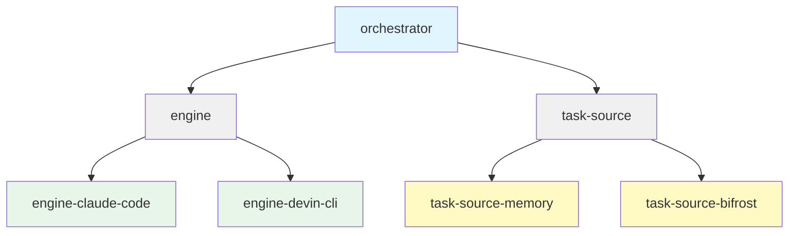

# 20250624-010. Monorepo Package Structure

Date: 2025-06-24
Version: 1

## Status

Proposed

## Context

Framework has multiple concerns: engine interfaces, task source interfaces, orchestrator core, concrete implementations. Need clear separation while maintaining type safety and build efficiency.

## Decision

Monorepo with npm workspaces. Core interfaces separate from implementations. Each implementation depends only on interfaces, not other implementations.

```
packages/
├── engine/                    # Core Engine interface
├── task-source/              # Core TaskSource interface
├── orchestrator/             # Core orchestration logic
├── engine-claude-code/        # Claude Code engine impl
├── engine-devin-cli/          # Devin CLI engine impl
├── task-source-memory/        # In-memory task source
└── task-source-bifrost/       # Bifrost API task source
```

**Dependency graph:**



## Consequences

**Positive:**

- Clear separation of concerns
- Interface stability enforced (interfaces don't depend on impls)
- Independent versioning possible
- Easy to add new implementations
- Type safety across workspace
- npm workspaces for local linking

**Negative:**

- Build complexity (workspaces, linking)
- Package interdependencies can be confusing
- Publishing requires multiple packages
- Circular dependencies risk

## Changelog

- Organize as monorepo with npm workspaces for clear separation of interfaces and implementations
